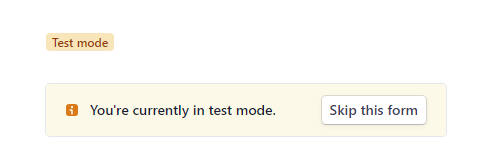

# lucchetto.js

Client side JavaScript helper utilities for working with [pay2my.app](https://pay2my.app) in-app purchase widgets leveraging [Armadietto+Lucchetto](https://github.com/overhide/armadietto/tree/master/lucchetto) extended [remote-storage](https://remotestorage.io) server implementations such as [overhide.io](https://overhide.io#baas).


## [The Documentation](https://overhide.github.io/lucchetto/docs/lucchetto.js-rendered-docs/index.html)

[Read the docs](https://overhide.github.io/lucchetto/docs/lucchetto.js-rendered-docs/index.html) and see its simple use in the:

- [pay2my.app demos](https://www.npmjs.com/package/pay2my.app/v/latest#demos)
- [*Remote Storage* Tutorial](https://github.com/overhide/remotestorage-tutorial) 


## Usage

### Bring It In

In your `package.json`:

```
  "dependencies": {
    ..
    "lucchetto": "^1.0.14",
    ..
  }
```


Or from a CDN:

```
 <script src="https://cdn.jsdelivr.net/npm/lucchetto/dist/lucchetto.js"></script>
```


### Use It In Any of Your (non *RS*) Applications

See the [How-To Tutorial Guide](https://github.com/overhide/pay2my.app/blob/master/howto/intro/README.md) but skip the "Leveraging a Back-End" section:  after all you're here leveraging this *lucchetto.js* with a hosted back-end.

Once available, in your source code call the back-end:

``` 
 var lucchetto = new Lucchetto({
     overhideIsTest: true, 
     pay2myAppHub: document.getElementById('hub-id-in-dom'),
     overhideApiKey: '0x42..cb'});
 ...
 window.addEventListener('pay2myapp-appsell-sku-clicked', async (e) => { 
   ...
   const result = await lucchetto.getSku(`https://test.rs.overhide.io`, e.detail);
   console.log(`got SKU results`, { sku: e.detail.sku , result });
   ...
 }, false);
```


> ⚠ Take note of the missing *remoteStorage* parameter: our users are not connecting with the RS mechanism in our non-RS apps.
>
> ⚠ Here we're passing in the *overhideApiKey* for our use &mdash; [get an API key](https://token.overhide.io/register) for the right network, either  testnet or mainnet.  This is not a secret.


The `https://test.rs.overhide.io` is the [Armadietto+Lucchetto](https://github.com/overhide/armadietto/tree/master/lucchetto) RS server you're storing your IAP SKUs on, can be one of:

-  [https://test.rs.overhide.io](https://test.rs.overhide.io/) for testnet / fake money / coding
-  [https://rs.overhide.io](https://rs.overhide.io/) for live / production deployment


### Use It In Your [*Remote-Storage*](https://remotestorage.io) Applications

Use in conjunction with [remotestorage.js](https://github.com/remotestorage/remotestorage.js) within your *remotestorage* (RS) enabled application.

Read the [*Remote Storage* Tutorial](https://github.com/overhide/remotestorage-tutorial).

> ⚠ *Lucchetto* is useful in support of in-app purchases when your RS app users connect to a regular RS server; but extra useful when users connect storage from an *extended* *Lucchetto* RS server.


Once available, in your source code make *Lucchetto* work off of  [remotestorage.js](https://github.com/remotestorage/remotestorage.js) :

``` 
 var rsClient = new RemoteStorage();
 var lucchetto = new Lucchetto({
     remoteStorage: rsClient,
     overhideIsTest: true, 
     pay2myAppHub: document.getElementById('hub-id-in-dom'),
     overhideApiKey: '0x42..cb'}});
 ...
 window.addEventListener('pay2myapp-appsell-sku-clicked', async (e) => { 
   ...
   const result = await lucchetto.getSku(`https://test.rs.overhide.io`, e.detail);
   console.log(`got SKU results`, { sku: e.detail.sku , result });
   ...
 }, false);
```


>  ⚠ Here we're also passing in the *overhideApiKey* for our use &mdash; [get an API key](https://token.overhide.io/register) for the right network, either testnet or mainnet.  The *overhideApiKey* is optional since we'll usually leverage an *overhide* token from *remoteStorage*.  But if the *remoteStorage* connected to our application is not to a *Lucchetto* extended RS server, it won't have the *overhide* token, and we need to fail back to this default key.  This is not a secret.


*Lucchetto* will respond to connections against *remotestorage.js* and update it's state.  


The `https://test.rs.overhide.io` is the [Armadietto+Lucchetto](https://github.com/overhide/armadietto/tree/master/lucchetto) RS server you're storing your IAP SKUs on, can be one of:

-  [https://test.rs.overhide.io](https://test.rs.overhide.io/) for testnet / fake money / coding
-  [https://rs.overhide.io](https://rs.overhide.io/) for live / production deployment


## Onboarding In-App Purchases for Use In Your App

There are some additional steps needed to have your app leverage *Lucchetto* for in-app purchases.  The main steps are outlined below. 

Again, all of this is also covered, step by step, in our [how-to tutorial guide](https://github.com/overhide/remotestorage-tutorial).


#### Onboard to US Dollars Ledger &mdash; as the Dev Receiving $

The payments integration for IAPs uses *Ledger-Based Authorizations* as per https://pay2my.app.

Dollars payments are verified against a receipts ledger where the receipts are actually made out to your (the developer's) public Ethereum address:  an Ethereum address is used for all currencies in this setup.

As such we must tell the US dollars ledger what public Ethereum address to associate with your (the developer's) https://stripe.com account &mdash; all value transfers via credit cards occurs through https://stripe.com.  If you don't have a *Stripe.com* account, the ledger onboarding  process will guide you to create one.


> ⚠ You do not need an actual *Stripe.com* account when testing with fake money and testnets.  You can play around with all of this and develop your application without onboarding to *Stripe.com*.  
>
> When [onboarding your Ethereum address to the testnet](https://test.ledger.overhide.io/onboard) simply skip the *Stripe.com* account setup:
>
> 


If you connect your in-browser Ethereum [web3.js](https://web3js.readthedocs.io/) enabled wallet to the onboarding page, you'll be able to use your wallet's address for the onboarding.  


> ⚠ Connecting your in-browser Ethereum [web3.js](https://web3js.readthedocs.io/) enabled wallet to the dollars onboarding page is by far the preferred way to go.


If you do not have an public Ethereum address yet, the onboarding process will guide you to generate one.  Make sure to note down the generated public address and private secret key.


To onboard:

- [testnet onboarding](https://test.ledger.overhide.io/onboard)
- [production onboarding](https://ledger.overhide.io/onboard)


Take note of your onboarded Ethereum address.


#### Onboard to Ethereum Ledger &mdash; as the Dev Receiving eth

*Cryptos* do not need onboarding — you do not need to register as a payee with any entity (i.e. [Stripe](https://stripe.com/)) like you do for *dollars* processing ([which is also simple enough](https://ledger.overhide.io/onboard)).

To start using Ethereum simply get an Ethereum wallet such as [MetaMask](https://metamask.io/) and generate the public Ethereum address you want to use.


#### Add SKUs

Consider the upsells (app-sells?) you'll want in your application.

For each such in-app purchase item &mdash; a SKU &mdash;  you'll need to upload a piece of data to your *Lucchetto* extended RS server (e.g. https://rs.overhide.io).

Use the [SKU setup RS app](https://overhide.github.io/armadietto/lucchetto/onboard.html#)  to do this.

For production make sure to use [@rs.overhide.io](https://rs.overhide.io) or a *Lucchetto* extended RS provider of your choice.

For testing you can use [@test.rs.overhide.io](https://test.rs.overhide.io).

The app has all the necessary instructions.


#### Add IAP Buttons Against Above SKU Data

When your users make an IAP purchase you need to validate their payment &mdash; en perpetuity &mdash; and get the data backing your SKU (what you added in the previous section to your RS server).

The IAP buttons use wire up all the necessary information:

```
<pay2myapp-appsell 
  ...
  sku="boost"
  priceDollars="1.50"
  withinMinutes="2"
  ...
  ethereumAddress="0xd6106c445a07a6a1caf02fc8050f1fde30d7ce8b"
  overhideAddress="0xd6106c445a07a6a1caf02fc8050f1fde30d7ce8b">
  ...
</pay2myapp-appsell>
```

Notice that the SKU dimensions asked for in the [SKU setup RS app](https://overhide.github.io/armadietto/lucchetto/onboard.html#) are also expected in the button:

- sku
- priceDollars
- withinMinutes

These must match as SKU configured with the app as per the previous section.

The `overhideAddress` is your US dollars Ethereum linked address as per the US dollars ledger onboarding section above.  Similarly the `ethereumAddress`  is the Ethereum address you wish to receive ethers on.

